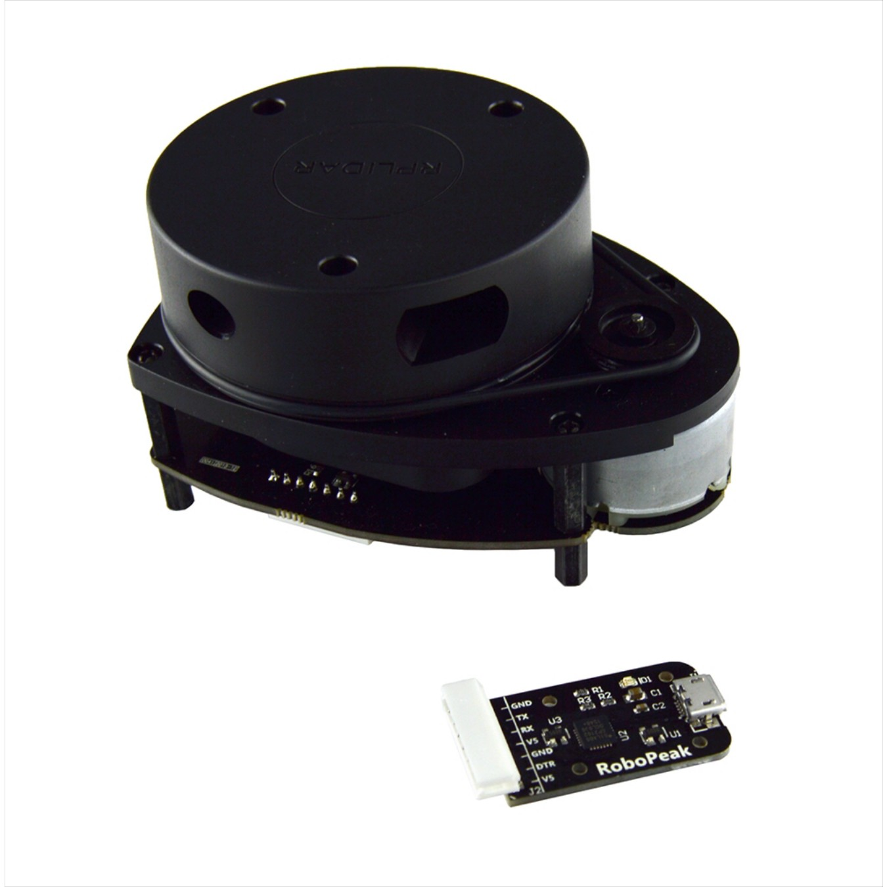

# ROS Delivery Robot With Autonomous Navigation

## The Robot Harware Setup 🔧

|||
| :-----: | :-: |
| |  |
|| 

## Installation 💻

```
cd ~/catkin_ws/src

git clone 

cd ..

git checkout ROS-PPR_v2

catkin_make

rosdep install --from-paths src --ignore-src -r -y


```
If catkin_make shows error, install the missing dependenices using the rosdep command.  

## 3D modelling and Simulation 
The Robot was modelled in Fusion360 and converted to URDF using [fusion2urdf](https://github.com/syuntoku14/fusion2urdf).
Gazebo Pluggins for [differential drive](http://gazebosim.org/tutorials?tut=ros_gzplugins#DifferentialDrive),Odometry and [LaserScan](http://gazebosim.org/tutorials?tut=ros_gzplugins#Laser) were added to the urdf and tested in a custom made simulation environment/world in Gazebo.
  
### Demo Image 👇

[| |](https://drive.google.com/file/d/1WlGlnpkVvof-NxX-1dJMyZwHd8phcsZC/view?usp=sharing)

# Simulation Setup
## Mapping 
Open a new terminal window and split it accordingly if using terminator,run the following commands 
```
roslaunch navbot_description gazebo.launch

roslaunch gmapping mapping.launch

rosrun teleop_twist_keyboard teleop_twist_keyboard.py

rviz

rosrun map_server map_saver -f newmap
```
The map is already saved in /navbot_description/maps directory if using the preset map.

## Mapping Using G-Cartographer
To get Mapping done without Odem.
* To install the G-Cart properly you require ROS Melodic Env and then follow these Steps. [ Building & Installation](https://google-cartographer-ros.readthedocs.io/en/latest/compilation.html#building-installation).
* To Create Your Own Bag And Get Started with G-Cart Go Through [Running Cartographer ROS on your own bag](https://google-cartographer-ros.readthedocs.io/en/latest/your_bag.html).

## Navigation Within Gazebo Env.
```
roslaunch navbot_description gazebo.launch

roslaunch navbot_navigation move_base.launch

rviz
```
* After opening Rviz open the configuration file from the Rviz folder.
* Type rqt in terminal and open dynamic reconfigure pluggin, load the final_reconf_param_sim.yaml from the reconf_params folder and you are all set to give navigation goals.

## Navigation With ROSBag.
```
roslaunch navbot_description gazebo.launch

roslaunch navbot_navigation move_base.launch

rviz
```
To check the list of rostopic currently available
```
rostopic list -v
```
To Record a specific topic
```
rosbag record -O /cmd_vel /right_ticks /left_ticks
```
To Record All topics
```
rosbag record -a
```
To Get Info on a specific Rec Bag
```
rosbag info <Bag Name>
```
To Get the entire specific Rec Bag Play again all i/o
```
rosbag play <Bag Name>
```
* At the time of executing the Commands / Simulation run the above commands based on the topics to be observed and recorded so as to re-run the files to get the same results.
* It's used to observe the Behaviour and also can be used as Learn & Repeat Function.

# Working in brief
### Note: BOM and references are attached towards the end.

* Starting from the low-level control the Robot uses an **Arduino Mega** takes **cmd_vel** from the Rasberry Pi4 via **ros-serial** via USB. The Arduino is also responsible for reading the encoder values and publishing it back to the Rasberry Pi4.
### Topics published and subscribed by Arduino
```
/cmd_vel
/right_ticks
/left_ticks 
```
* I have used **RMCS-2303** Motor drivers for controlling the Dc motors with encoders. The motor driver has inbuilt PID control implemented with the help of an STM32 MicroController.

*  The Motor driver is connected to Arduino via **UART** (Tx,RX). 2 such motor drivers where used to control the 2 motors and each motors where addresed using a **unique slave-id** set via jumper pins.

* The main advantage of using this motors were that only 3 wires (Tx,Rx,Gnd) was required to control all the 2 motors,vary its speed.
 
* The High level control is Rasberry Pi4 which runs on [Rasberry Pi](https://www.raspberrypi.com/products/raspberry-pi-4-model-b/) based on ubuntu 18.04 with [ROS Melodic](http://wiki.ros.org/melodic/Installation/Ubuntu) installed.

* The Lidar is also connected to the Rasberry Pi4 via Usb and the whole system is powered using 12v from the Li-Ion Battery pack with max power for Motor Driver & Battery Bank for the Rasberry Pi4.

## ROS Setup for Mapping and Navigation 

* The arduino publishes the encoder ticks into the Rasberry Pi4 via ros-serial which are subscribed by the [differential_drive](http://wiki.ros.org/differential_drive) package and publishes **/odom** as well as **Tf** **(odom -> base_footprint)**.

The Rp-Lidar package is responsible for publishing the LaserScan as **/scan** data along with **Tf** **(base_link -> laser)**

## Real Robot Setup

* Before setting up and running the robot,Rasberry Pi4 and host machine should be set up following this tutorial -> [ROS Network setup](http://wiki.ros.org/ROS/NetworkSetup)

### Rasberry Pi 4 🤖
```
roscore

rosrun rosserial_python serial_node.py /dev/ttyACM0

roslaunch rplidar_ros view_rplidar.launch

roslaunch differential_drive tf_controller.launch

```
### Main Laptop 💻
```
roscore

roslaunch navbot_navigation move_base.launch

rviz

```

* After running Rviz open the Navbot.rviz configuration from the Rviz folder.

* Open DynamicReconfigure from rqt gui and load final_reconf_params_real.yaml

* Give the goal location in Rviz and we are good to go!


## Components Used

| Component     | Image           |
| ------------- |:-------------:|
| [Rasberry Pi4](https://www.raspberrypi.com/products/raspberry-pi-4-model-b/) || 
| [RP-Lidar](https://www.amazon.com/Slamtec-RPLIDAR-Scanning-Avoidance-Navigation/dp/B07TJW5SXF)|| 
|[Arduino Mega](https://robu.in/product/arduino-mega-2560-board-with-compatible-usb-cable/)|| 
| [RMCS 2303 Motor Drivers](https://robokits.co.in/motor-drives-drivers/encoder-dc-servo/rhino-dc-servo-driver-10v-30v-50w-5a-compatible-with-modbus-uart-ascii-for-encoder-dc-servo-motor)|
| [100 RPM Motors](https://robokits.co.in/motors/encoder-dc-servo/high-torque-high-precision-motor/high-torque-high-precision-encoder-dc-geared-motor-12v-100rpm)|
|[4,200Mah, Li-Ion Battery](https://robokits.co.in/batteries-chargers/skycell-li-ion-battery/11.1vli-ion-batteries-9.6-12.6v/li-ion-11.1v-10000mah-2c-with-inbuilt-charger-protection) |
|[2 Wheels](https://robokits.co.in/robot-wheels/rubber-tracked-wheels/robot-wheel-125mm-diameter-60mm-width-for-atv) | 

## References

[RMCS 2303 Motor Driver Manual](https://robokits.download/downloads/RMCS-2303%20updated%20datasheet.pdf)

[RMCS 2303 Arduino Library](https://robokits.co.in/downloads/RMCS2303drive_V2.zip)

[Motor Specifications](https://robokits.download/downloads/RMCS-5013.pdf)

[ROS Navigation Tuning Guide](https://kaiyuzheng.me/documents/navguide.pdf)

[Map Float Arduino Library](https://github.com/radishlogic/MapFloat)

* The photos and videos that I took during the build, has been made into a final video!

# Future UpDate On ROS Delivery Bot v2.4 
 
## Support for Odom from T265 + TF correction

* Added Support for using Odom from Intel RealSense T265 Tracking Camera
* Added the required TF Launch files for the same
    * To use Odometry from T265 run these extra commands

 ```
roslaunch navbot_navigation tf.launch 
 ```  

## ROS Setup for Mapping and Navigation 

* The arduino publishes the encoder ticks into the Rasberry Pi4 via ros-serial which are subscribed by the [differential_drive](http://wiki.ros.org/differential_drive) package and publishes **/odom** as well as **Tf** **(odom -> base_footprint)**.

The Rp-Lidar package is responsible for publishing the LaserScan as **/scan** data along with **Tf** **(base_link -> laser)**

 ## To UpDate Base Local Planner -> DWA to TEB

Use the bellow command to install and UpDate from DWA to TEB
```
sudo apt-get install ros-noetic-teb-local-planner
```

### To Use 3D vision -> RTAB mapping, Point Cloud Generation Refer

[Kinect Drivers + ROS Package installation](https://aibegins.net/2020/11/22/give-your-next-robot-3d-vision-kinect-v1-with-ros-noetic/)

* After installtion the following command will open up the depth stream / PointCloud in Rviz

```
roslaunch freenect_launch freenect.launch depth_registration:=true
```

## FINAL WORKING VIDEO 👇

[](https://drive.google.com/file/d/1WlGlnpkVvof-NxX-1dJMyZwHd8phcsZC/view?usp=sharing)

## Team Member
* Mr. Vadiraja Acharya, Asst. Prof, Dept of CSE, PESU
  * Internship
    * D G Harshith, 7th SEM, ECE, PESU
